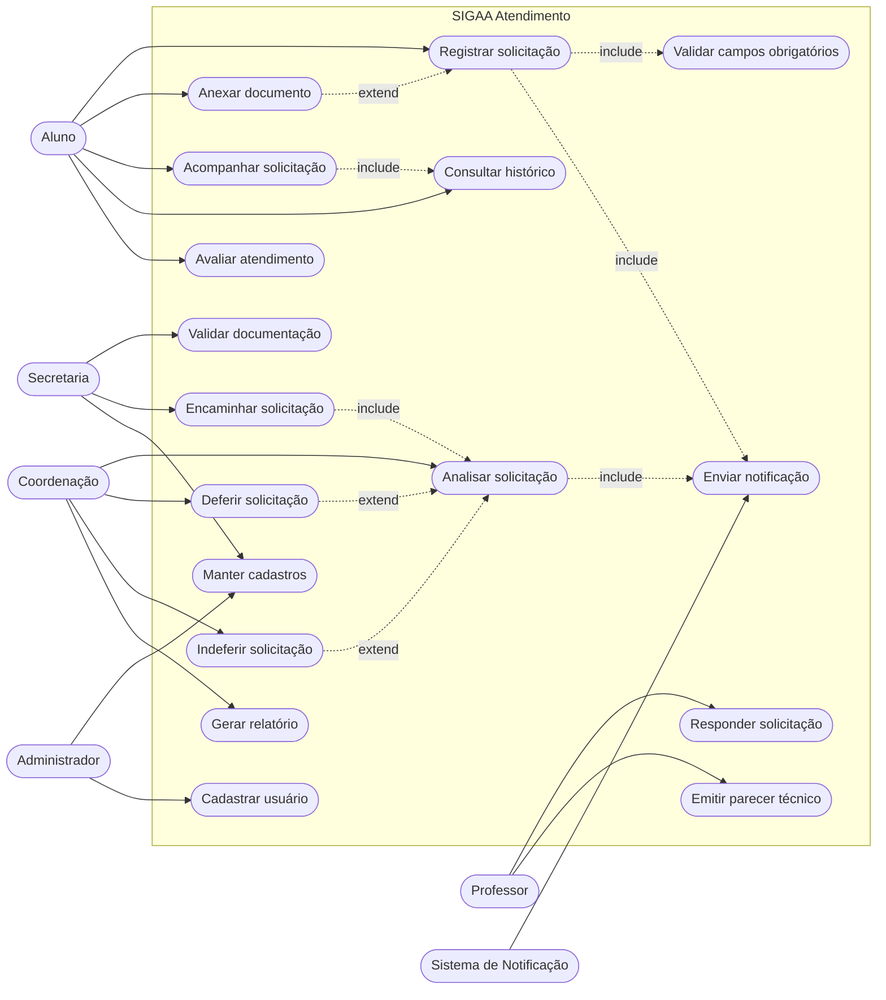
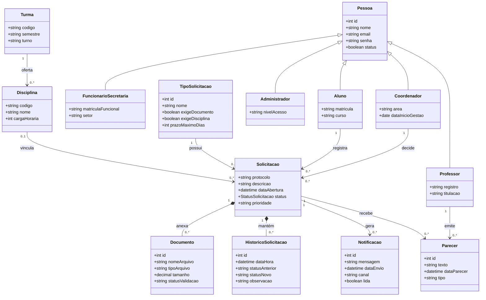
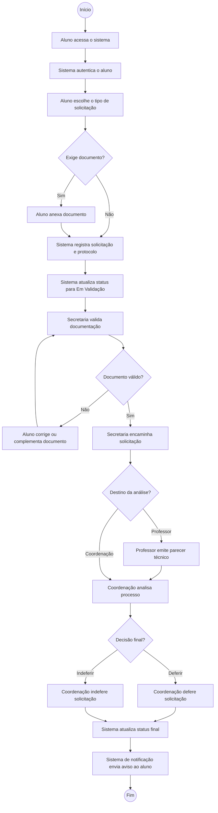
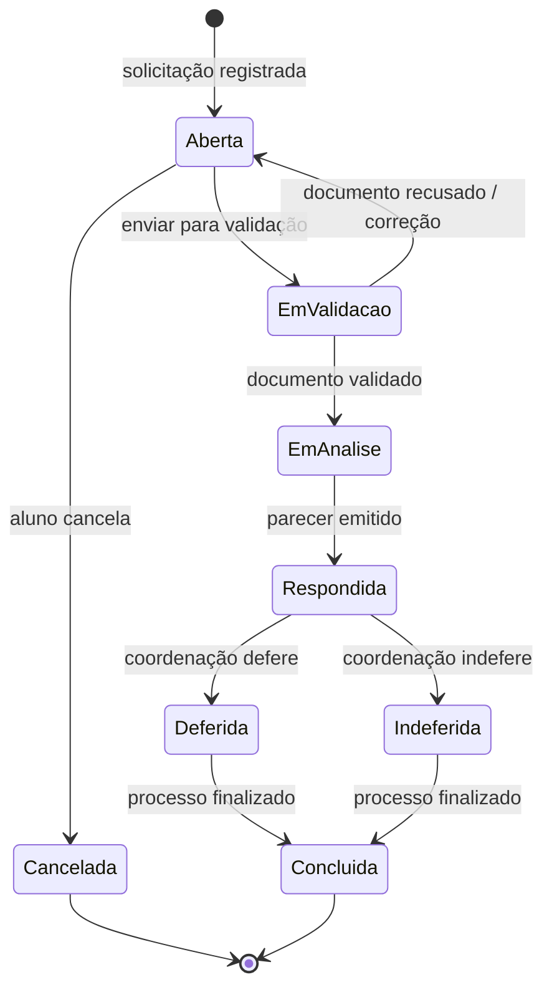
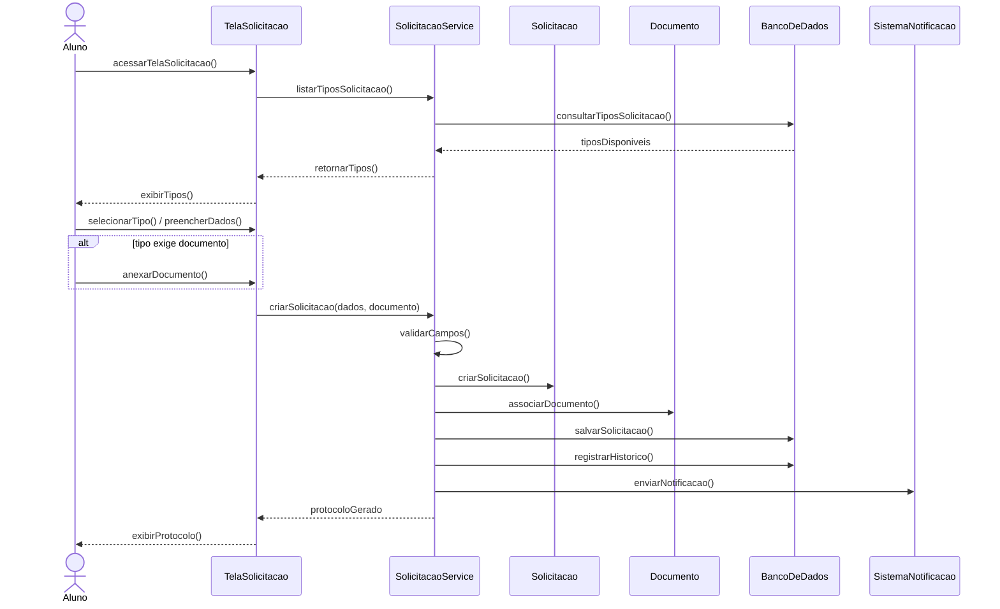
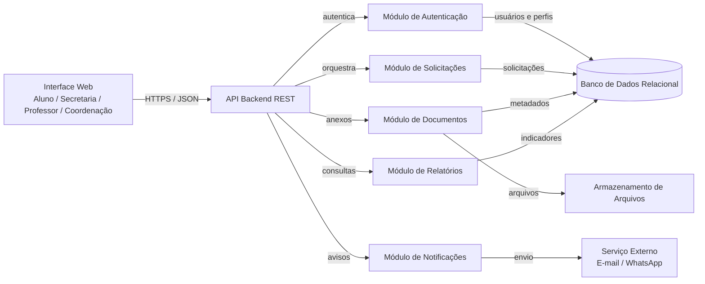
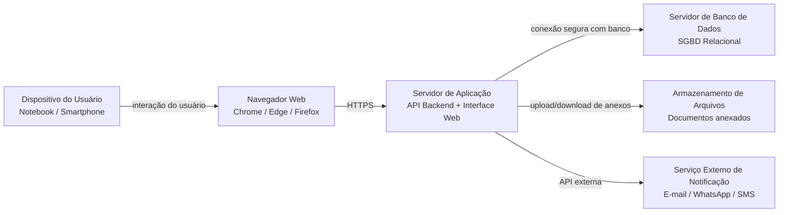

# Atividade Prática de UML

## Modelagem de Sistema Acadêmico: SIGAA Atendimento

**Disciplina:** UML / Modelagem de Sistemas / Engenharia de Software  
**Professor:** Abraão Henrique  
**Instituição:** Estácio Ceará  
**Ano:** 2026

---

## Equipe

| Nome completo | Matrícula |
|---|---:|
| Matheus Freire Martins da Costa | 202402217267 |
| Paulo Welton Cardoso Costa | 202403592691 |
| Carlos Gabriel da Silva Castro | 202404248151 |
| José Gabriel Almeida Silveira | 202404022161 |
| Joao Vitor Moreira Costa | 202402863975 |

---

# 1. Introdução

Este relatório apresenta a modelagem UML do sistema **SIGAA Atendimento**, uma solução web voltada à gestão de solicitações acadêmicas. O objetivo é representar o sistema sob diferentes perspectivas: requisitos, casos de uso, estrutura, comportamento, interações, componentes e implantação.

O trabalho não propõe implementação de código. O foco é a análise do domínio, a coerência entre os artefatos UML e a organização técnica da solução.

---

# 2. Descrição do problema

Atualmente, solicitações acadêmicas costumam ocorrer por canais informais, como WhatsApp, e-mail ou atendimento presencial. Esse processo dificulta a rastreabilidade, gera perda de informações, reduz a previsibilidade das respostas e prejudica o acompanhamento por parte do aluno e da instituição.

O **SIGAA Atendimento** centraliza o registro, a validação, o encaminhamento, a análise e a conclusão das solicitações acadêmicas, mantendo histórico completo e comunicação formal entre aluno, secretaria, professor e coordenação.

---

# 3. Objetivo do sistema

Permitir que alunos registrem solicitações acadêmicas, anexem documentos, acompanhem o andamento do processo e recebam notificações. A secretaria valida documentos e encaminha processos; professores emitem parecer técnico; a coordenação defere ou indefere solicitações; e administradores mantêm cadastros e configurações.

---

# 4. Público-alvo

O público-alvo é formado por:

- Alunos;
- Secretaria acadêmica;
- Professores;
- Coordenação de curso;
- Administradores do sistema.

O sistema também se integra a um serviço externo de notificação para envio de avisos.

---

# 5. Documento de requisitos

## 5.1 Requisitos funcionais

| Código | Requisito funcional |
|---|---|
| RF01 | O sistema deve permitir o cadastro de alunos. |
| RF02 | O sistema deve permitir o cadastro de professores. |
| RF03 | O sistema deve permitir o cadastro de disciplinas e turmas. |
| RF04 | O sistema deve permitir que o aluno registre uma solicitação acadêmica. |
| RF05 | O sistema deve permitir que o aluno anexe documentos à solicitação. |
| RF06 | O sistema deve permitir que o aluno acompanhe o status da solicitação. |
| RF07 | O sistema deve permitir que a secretaria valide documentos enviados. |
| RF08 | O sistema deve permitir o encaminhamento para professor ou coordenação. |
| RF09 | O sistema deve permitir que o professor responda solicitações. |
| RF10 | O sistema deve permitir que a coordenação aprove ou indefira solicitações. |
| RF11 | O sistema deve permitir o envio de notificações ao aluno. |
| RF12 | O sistema deve permitir a geração de relatórios. |
| RF13 | O sistema deve permitir avaliação do atendimento pelo aluno após a conclusão. |
| RF14 | O sistema deve permitir consulta ao histórico completo de movimentações da solicitação. |
| RF15 | O sistema deve permitir filtro de solicitações por status, tipo, aluno, disciplina e período. |

## 5.2 Requisitos não funcionais

| Código | Requisito não funcional |
|---|---|
| RNF01 | O sistema deverá ser web e responsivo. |
| RNF02 | O sistema deverá possuir autenticação por login e senha. |
| RNF03 | O sistema deverá registrar data e hora de cada movimentação. |
| RNF04 | O sistema deverá utilizar banco de dados relacional. |
| RNF05 | O sistema deverá seguir arquitetura em camadas ou padrão MVC. |
| RNF06 | O sistema deverá permitir acesso conforme o perfil do usuário. |
| RNF07 | O tempo de resposta das operações principais não deverá ultrapassar 3 segundos. |
| RNF08 | O sistema deverá manter histórico das alterações realizadas. |
| RNF09 | Os documentos anexados deverão aceitar preferencialmente formato PDF e imagem. |
| RNF10 | O sistema deverá manter trilha de auditoria para ações críticas. |

## 5.3 Regras de negócio

| Código | Regra de negócio |
|---|---|
| RN01 | Uma solicitação deve estar vinculada a um único aluno. |
| RN02 | Uma solicitação deve possuir obrigatoriamente um tipo de solicitação. |
| RN03 | Solicitações de segunda chamada devem conter documento comprobatório. |
| RN04 | Solicitações de revisão de nota devem estar vinculadas a uma disciplina. |
| RN05 | Uma solicitação pode ser encaminhada para professor, secretaria ou coordenação. |
| RN06 | O aluno não pode alterar uma solicitação após ela entrar em análise. |
| RN07 | A coordenação pode deferir ou indeferir uma solicitação. |
| RN08 | O professor pode emitir parecer técnico sobre solicitações acadêmicas. |
| RN09 | Toda solicitação deve possuir um status atual. |
| RN10 | Os status possíveis são: Aberta, Em Validação, Em Análise, Respondida, Deferida, Indeferida, Cancelada e Concluída. |
| RN11 | Toda solicitação concluída deve permanecer disponível para consulta no histórico. |
| RN12 | Solicitações sem documentação obrigatória não podem avançar para análise. |

---

# 6. Diagrama de casos de uso

O diagrama de casos de uso apresenta os atores principais do sistema e suas interações com as funcionalidades essenciais do SIGAA Atendimento.

**Figura 1 -** Casos de uso, atores obrigatórios, relacionamentos `include` e `extend` aplicados ao SIGAA Atendimento.

---

# 7. Descrição textual dos casos de uso

## 7.1 Caso de uso: Registrar Solicitação Acadêmica

| Campo | Descrição |
|---|---|
| Caso de uso | Registrar Solicitação Acadêmica |
| Ator principal | Aluno |
| Atores secundários | Sistema de Notificação |
| Pré-condições | Aluno autenticado no sistema e cadastro ativo. |
| Fluxo principal | 1. Aluno acessa a tela de solicitação. 2. Sistema lista tipos de solicitação. 3. Aluno seleciona o tipo. 4. Aluno informa descrição e disciplina, quando exigido. 5. Aluno anexa documento, quando obrigatório. 6. Sistema valida os campos. 7. Sistema registra a solicitação. 8. Sistema gera protocolo e histórico inicial. 9. Sistema envia notificação ao aluno. |
| Fluxos alternativos | A1: Se o tipo não exigir documento, o sistema permite o registro sem anexo. A2: Se for revisão de nota, o aluno deve selecionar a disciplina vinculada. |
| Fluxos de exceção | E1: Campos obrigatórios ausentes impedem o registro. E2: Documento inválido impede o envio. E3: Falha no banco de dados cancela a gravação e informa erro. |
| Pós-condições | Solicitação registrada com protocolo, status inicial Aberta e histórico criado. |
| Regras relacionadas | RN01, RN02, RN03, RN04, RN09, RN10 e RN12. |

## 7.2 Caso de uso: Validar Documentação

| Campo | Descrição |
|---|---|
| Caso de uso | Validar Documentação |
| Ator principal | Secretaria |
| Atores secundários | Aluno e Sistema de Notificação |
| Pré-condições | Solicitação registrada e em status Em Validação. |
| Fluxo principal | 1. Secretaria acessa solicitações pendentes. 2. Sistema exibe documentos anexados. 3. Secretaria verifica validade dos documentos. 4. Secretaria aprova a documentação. 5. Sistema atualiza histórico. 6. Secretaria encaminha para professor ou coordenação. 7. Sistema notifica o aluno sobre a movimentação. |
| Fluxos alternativos | A1: Caso o documento esteja incompleto, a secretaria solicita correção ao aluno. |
| Fluxos de exceção | E1: Documento corrompido ou formato inválido impede a validação. E2: Solicitação sem anexo obrigatório não pode ser encaminhada. |
| Pós-condições | Solicitação encaminhada para análise ou devolvida ao aluno para correção. |
| Regras relacionadas | RN03, RN05, RN09, RN10 e RN12. |

---

# 8. Diagrama de classes de análise

**Figura 2 -** Classes principais do domínio, heranças, associações, composições e multiplicidades obrigatórias.

---

# 9. Diagrama de atividades

**Figura 3 -** Fluxo de registro e processamento da solicitação acadêmica com decisões e responsabilidades separadas.

---

# 10. Diagrama de estados

**Figura 4 -** Ciclo de vida da classe Solicitação, com estados e eventos de transição.

---

# 11. Diagrama de sequência

**Figura 5 -** Interação temporal do caso de uso Registrar Solicitação Acadêmica.

---

# 12. Diagrama de componentes

**Figura 6 -** Organização lógica dos módulos implementáveis do sistema.

---

# 13. Diagrama de implantação

**Figura 7 -** Nós computacionais, comunicação HTTPS/API e dependências externas.

---

# 14. Justificativas das decisões de modelagem

| Decisão | Justificativa |
|---|---|
| Herança a partir de Pessoa | Aluno, Professor, Funcionário de Secretaria, Coordenador e Administrador compartilham atributos comuns, como nome, e-mail, senha e status. A herança reduz repetição no modelo conceitual e deixa claro que todos representam usuários/pessoas do domínio acadêmico. |
| Documento como classe própria | O documento possui atributos e ciclo próprio, como nome do arquivo, tipo, tamanho e status de validação. Por isso, não deve ser apenas um atributo textual da solicitação. |
| HistóricoSolicitacao associado à solicitação | A atividade exige rastreabilidade. O histórico registra cada mudança de status, data, hora e observação, permitindo auditoria e acompanhamento do processo. |
| Parecer como classe própria | O parecer técnico contém texto, data, autor e tipo. Como uma solicitação pode receber pareceres e esses pareceres têm significado próprio, o modelo fica mais coerente com uma classe específica. |
| Notificação associada à solicitação | Cada movimentação relevante pode gerar aviso ao aluno. Modelar Notificação como classe permite registrar canal, mensagem, data de envio e leitura. |

---

# 15. Coerência entre os artefatos

Os requisitos funcionais aparecem nos casos de uso e são refletidos nos diagramas comportamentais. O caso de uso **Registrar Solicitação Acadêmica** é detalhado textualmente e também aparece nos diagramas de atividades e sequência.

O diagrama de classes fornece as entidades usadas pelos fluxos, enquanto os diagramas de componentes e implantação mostram como a solução pode ser organizada em módulos e nós computacionais.

---

# 16. Conclusão

A modelagem proposta representa o **SIGAA Atendimento** de forma coerente com o problema apresentado. O sistema centraliza solicitações acadêmicas, melhora a rastreabilidade, organiza responsabilidades entre os perfis envolvidos e registra o ciclo completo da solicitação.

Os diagramas UML foram estruturados para manter consistência entre requisitos, casos de uso, classes, atividades, estados, sequência, componentes e implantação.
